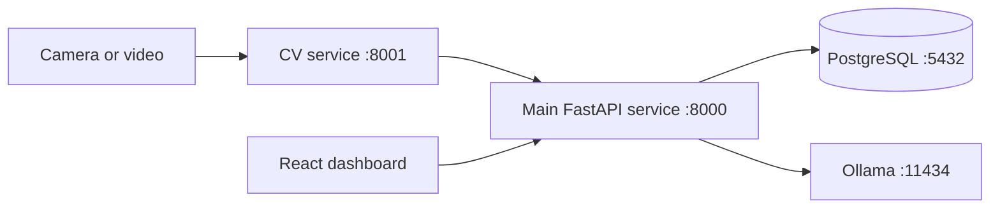

<div align="center">

# ElevatorAI Sunybot

**A local-first intelligent elevator platform combining real-time computer vision, an LLM assistant, backend APIs, and operational data in one Windows 11 monorepo.**


</div>

## Overview

ElevatorAI Sunybot is an engineering prototype for exploring how AI can improve elevator monitoring, safety, maintenance, and human-machine interaction. The system brings together a React dashboard, FastAPI services, PostgreSQL, local Ollama models, and a real-time computer vision pipeline.

The project is designed to run locally, keeping camera data, operational events, and LLM interactions under the user's control.

## Key Capabilities

| Area | Capabilities |
|---|---|
| Computer Vision | Real-time person detection, occupancy monitoring, pose/fall analysis, face recognition, and camera event generation |
| AI Assistant | Local Ollama-based assistant, embeddings, semantic matching, conversation context, and service/tool routing |
| Backend | FastAPI integration layer connecting the dashboard, CV service, LLM service, and operational data |
| Data | PostgreSQL storage for CV events, occupancy samples, people, face embeddings, conversations, and system events |
| Dashboard | React/Vite interface for elevator status, camera monitoring, AI interaction, SOS, floor control, and maintenance |
| Edge Deployment | ONNX/TensorRT-oriented CV deployment with development support for CPU, GPU, and NVIDIA Jetson environments |

> Some AI functions depend on local model files, camera hardware, PostgreSQL, and Ollama configuration. See [Project Status](#project-status) for the current scope.

## System Architecture



## Repository Structure

| Path | Purpose |
|---|---|
| `Elev_Web-main/` | React/Vite frontend source |
| `ElevatorAI-Sunybot-v2/` | Main FastAPI backend, LLM integration, APIs, and compiled web UI |
| `ElevatorAI-Sunybot-cv-v2/` | Real-time computer vision backend |
| `win11_startup_pack/` | PowerShell and batch scripts for the Windows 11 runtime |
| `requirements-win.txt` | Shared Python dependencies for the Windows environment |

## Technology Stack

- **AI/LLM:** Ollama, local LLMs, embeddings, semantic retrieval, agent/tool routing
- **Computer Vision:** Ultralytics YOLO, OpenCV, InsightFace, ONNX Runtime, TensorRT-oriented deployment
- **Backend:** Python, FastAPI, Uvicorn, REST APIs
- **Frontend:** React 18, Vite, React Router
- **Database:** PostgreSQL, SQLAlchemy, Psycopg
- **Runtime:** Windows 11 and PowerShell

## Runtime Services

| Service | Default address |
|---|---|
| Main backend and dashboard | `http://127.0.0.1:8000/` |
| Main health check | `http://127.0.0.1:8000/health` |
| CV backend | `http://127.0.0.1:8001/` |
| CV status | `http://127.0.0.1:8001/api/cv/status` |
| CV integration status | `http://127.0.0.1:8000/api/integration/cv/status` |
| PostgreSQL | `127.0.0.1:5432` |
| Ollama | `http://127.0.0.1:11434` |

## Quick Start on Windows 11

### 1. Prerequisites

Install the following software:

- Git
- Python 3.9
- Node.js and npm
- PostgreSQL 16
- Ollama
- A webcam or video source for real-time CV testing

### 2. Clone the repository

The included startup scripts currently expect the project at `C:\elevator_ai`.

```powershell
cd C:\
git clone https://github.com/chanhuynguyen-ai/ElevatorAI-Sunybot-win11.git elevator_ai
cd C:\elevator_ai
```

If you use another location, update the paths inside `win11_startup_pack/02_start_cv_backend.ps1` and `win11_startup_pack/03_start_main_backend.ps1`.

### 3. Create the Python environments

```powershell
python -m venv .\ElevatorAI-Sunybot-cv-v2\.venv
.\ElevatorAI-Sunybot-cv-v2\.venv\Scripts\python.exe -m pip install --upgrade pip
.\ElevatorAI-Sunybot-cv-v2\.venv\Scripts\python.exe -m pip install -r .\requirements-win.txt

python -m venv .\ElevatorAI-Sunybot-v2\.venv
.\ElevatorAI-Sunybot-v2\.venv\Scripts\python.exe -m pip install --upgrade pip
.\ElevatorAI-Sunybot-v2\.venv\Scripts\python.exe -m pip install -r .\requirements-win.txt
```

If `onnxruntime-gpu` is incompatible with your machine, replace it with the CPU package specified in `requirements-win.txt`.

### 4. Build the frontend

```powershell
cd C:\elevator_ai\Elev_Web-main
npm install
npm run build
Copy-Item -Path .\dist\* -Destination ..\ElevatorAI-Sunybot-v2\gui\web\dist\ -Recurse -Force
cd C:\elevator_ai
```

Rebuild and copy `dist` again whenever the frontend source changes.

### 5. Prepare Ollama

```powershell
ollama pull qwen2.5:1.5b-instruct
ollama pull nomic-embed-text
ollama serve
```

### 6. Review local configuration

Before starting the system, check:

- PostgreSQL binary and data paths in `win11_startup_pack/01_start_postgresql.ps1`
- Database name, username, and password in the startup scripts
- Camera source and YOLO model paths in `win11_startup_pack/02_start_cv_backend.ps1`
- Ollama host and model names in `win11_startup_pack/03_start_main_backend.ps1`

### 7. Start the complete system

```powershell
powershell -ExecutionPolicy Bypass -File .\win11_startup_pack\start_all_win11.ps1
```

You can also double-click:

```text
win11_startup_pack\start_all_win11.bat
```

The launcher starts PostgreSQL, opens the CV backend and main backend in separate PowerShell windows, and then opens the dashboard at `http://127.0.0.1:8000/`.

### Lightweight CV mode

Use the lightweight launcher if the machine struggles with the full vision pipeline:

```powershell
powershell -ExecutionPolicy Bypass -File .\win11_startup_pack\02_start_cv_backend_light.ps1
```

### Stop the services

```powershell
powershell -ExecutionPolicy Bypass -File .\win11_startup_pack\stop_all_win11.ps1
```

For detailed setup and migration notes, read [WIN11_MIGRATION_AND_STARTUP_GUIDE.md](win11_startup_pack/WIN11_MIGRATION_AND_STARTUP_GUIDE.md).

## Basic Validation

After startup, verify the services:

```powershell
curl.exe http://127.0.0.1:8000/health
curl.exe http://127.0.0.1:8001/api/cv/status
curl.exe http://127.0.0.1:8000/api/integration/cv/status
```

If all three endpoints respond successfully, open `http://127.0.0.1:8000/` in a browser.

## Project Status

This repository is an active portfolio and research prototype, not a production-certified elevator control system.

| Component | Status |
|---|---|
| React dashboard and main API | Available |
| Windows 11 startup workflow | Available |
| PostgreSQL integration | Available with local configuration |
| Person detection and occupancy | Available with compatible models and camera |
| Pose/fall and face modules | Configurable; model and hardware dependent |
| Local LLM assistant | Configurable; requires Ollama models |
| ONNX/TensorRT and Jetson deployment | Experimental deployment path |

## Roadmap

- Replace machine-specific paths and credentials with validated `.env` configuration
- Upgrade and regularly audit the Python and FastAPI dependency set
- Complete end-to-end tests for CV events, PostgreSQL, dashboard updates, and LLM tool routing
- Add reproducible database migrations and sample configuration files
- Add automated tests, CI, runtime health reporting, and performance benchmarks
- Provide Docker Compose profiles for CPU and GPU development environments
- Add dashboard screenshots and a short demonstration video

## Security Notes

- Change all example database credentials before using the project outside a local development machine.
- Do not commit `.env`, virtual environments, model weights, logs, database dumps, or personal face data.
- Use synthetic or explicitly consented face data during development.
- Do not expose ports `8000`, `8001`, `5432`, or `11434` directly to the public internet.

## Author

**Nguyen Chan Huy**

- GitHub: [@chanhuynguyen-ai](https://github.com/chanhuynguyen-ai)
- LinkedIn: [linkedin.com/in/chanhuynguyen-ai](https://www.linkedin.com/in/chanhuynguyen-ai/)

If this project is useful to you, consider starring the repository.
